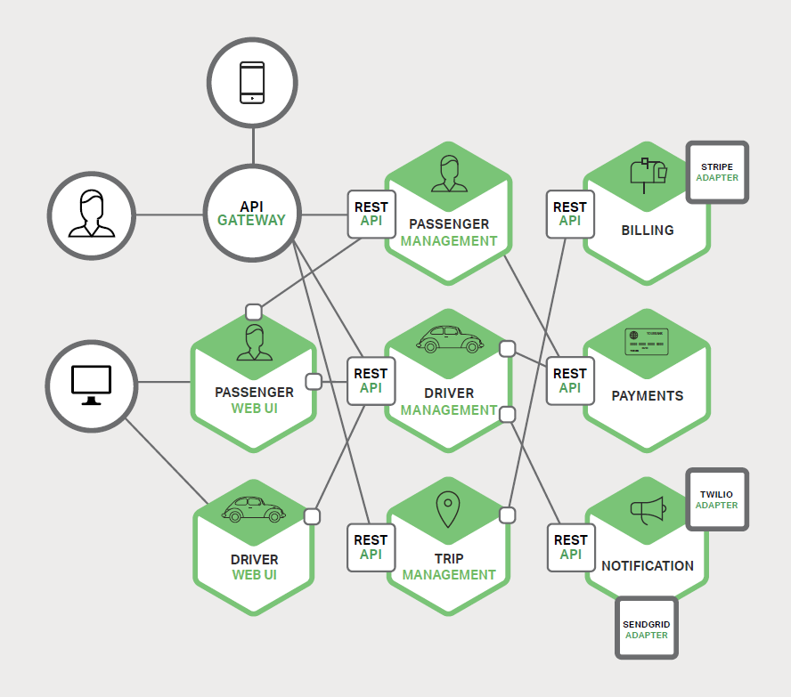

近几年，在技术圈掀起了一个非常流行的架构，它让几乎所有技术人为之疯狂，为之着迷，它就是微服务架构。到底何为微服务架构，跟出现很久的分布式架构有何区别？再者，和 SOA、ESB等概念又有什么不同呢？

## 一些误解 ##

- 两个团队在某个需求合作时，讨论完成后，结论是，我们采用微服务进行交互吧。

- 使用了 spring boot / spring cloud 就是微服务架构。

- 我们团队使用 docker 进行服务部署，就是微服务架构。

- ...

## 一些概念 ##
先来了解一些跟微服务相关的概念。

### 分布式 ###
何为分布式？简单来说，就是整个应用部署在 n（n>1） 台主机上。

从浏览器诞生，到现在的各种花式终端（台式机、笔记本、智能电视、智能手机、智能手表、智能体重计、智能音箱、智能电饭煲、智能台灯、智能收银台、智能机器人、无人汽车...）的发展过程中，我们经历了什么呢？
1. 网络世界从 www 开始，有仅仅通过 html 标签堆砌而成的丑到爆的信息页。

2. 有了 CSS 后，网络出现了各式各样的色彩，图片（虽然那时，网速非常慢，但我们等得起）也可以让我们看到一些更复杂的世界。

3. 动态页面。离线使用 C/C++、Perl 等生成页面，不需要再一行一行码 html 了。CGI、Servlet 技术的出现让请求页面实时生成。

4. 数据库。数据库的出现让数据更有条理地存储，更有利于数据的管理及动态页面的生成。

5. 应用和数据库分离。动态生成响应的应用程序和存储数据的数据库的分离，可以看作是分布式应用的一个孵化期。严格意义来讲，这其实不是大家所理解的分布式应用。

6. 应用服务器水平复制。随着访问量增加，应用服务器开始复制。如果有登录状态，需要解决 session 共享的问题。

7. 数据库读写分离。数据库压力变大，开始实施读写分离。

8. 数据库降压。搜索引擎、缓存、水平/垂直拆分都从一定程度上解决了数据库的压力。

9. 规模越来越大。公司(团队)需要根据不同业务拆分成不同的团队，以减轻单一团队维护过多功能而应接不暇。

### SOA & ESB ###
SOA(Service Oriented Architecture), 面向服务的架构。

单一系统越来越大，开发团队也越来越大，如果固守单一架构模式将遭受一些困境：
- 编写代码困难。多个模块很容易就受到影响，动不动就是多人联调修改 BUG。

- 代码库管理复杂。由于在同一个代码库中同时开发的人员过多，经常的 pull、push、commit等操作，增加冲突的几率，让开发人员需要投入更多的时候去解决冲突。

- 项目启动慢。因为应用过大，加载的东西很多，一次启动将耗费很长的时间。动辄几分钟，更有甚者，达到十几、二十分钟。这样就会导致开发人员在编写代码时，经常要重启服务，影响开发效率。也会影响线上更新部署效率，增加服务中断时长。

- 测试困难。一个小小的改动，测试人员需要反复回归测试，才能尽量保证测试的全面性。局部升级后，线上验证范围也比较大，起码也得把系统中的主要功能测试下。那么功能之间的相互影响为何不能在代码设计时规避呢？因为在一个项目工程中，开发人员稍不注意，就会动了别人的代码、或者引用了之前别人开发的另一块代码。

鉴于以上种种的问题，架构师会想到将系统拆分成多个系统。拆分并不是要根据功能做多个完全不想干的系统，如果那样的话，不同的系统都使用了用户管理模块，将会在每个系统中都有一套用户管理模块，带来的问题也是显而易见的。尽量拆分成多个系统后，还能够达到功能复用；也就是说，它拆分后，其实整体给用户的感觉还是一个系统。这时，就提出了 SOA 的架构思想（大概在2000年之前）。SOA 主要提倡的是服务化拆分、拆分后的复用性、标准化服务、有序组合。后来 XML 规范的提出，让 SOA 发展更快，典型的服务技术就是 WebService(SOAP)标准规范。

服务拆分开始后，可能会变得多，也可能各个服务使用的协议有所不同；将各服务组合起来，复杂性就增加了。

此时就需要 ESB 做为整个大系统中连接各个服务的管道，让各服务之间有条不紊地进行连接。

## 微服务 ##
微服务。重点是一个“**微**”字，也是服务拆分。

### 何时提出的？ ###
微服务的提出有很多个版本：
- 最易懂的版本。2014年3月，Martin Fowler（马丁·福勒）的一篇文章。[英文版](https://martinfowler.com/articles/microservices.html)。[中文版](http://blog.cuicc.com/blog/2015/07/22/microservices/)

> 微服务架构是一种架构模式，它提倡将单一应用程序划分成一组小的服务，服务之间互相协调、互相配合，为用户提供最终价值。每个服务运行在其独立的进程中，服务与服务间采用轻量级的通信机制互相协作（通常是基于HTTP协议的RESTful API）。每个服务都围绕着具体业务进行构建，并且能够被独立的部署到生产环境、类生产环境等。

- 最早期的版本。2012年3月，Fred George做了一个分享:

> 在演讲中，他描述了从2005~2009年期间，他和所在的团队是如何将100万行的传统J2EE程序，通过解耦、自动化验证等实践，逐渐分解成20多个5K行代码的小服务，又分解成200多个500行代码的服务的过程，而其中，也大谈了基于Kafka的消息解耦服务间依赖。

- 最简洁的版本。2014年11月提出。

> Loosely coupled service oriented architecture with bounded contexts.
> 重点在于 松耦合（独立部署更新）和 业务独立（不需要知道它的依赖者）。

- 最与时俱进的版本。2015年10月提出。

> Microservices are the first post DevOps revolution architecture.   
> 意思就是 微服务要和 DevOps 紧密结合起来，才能发挥最大的效用。

### 和 SOA 有何区别 ###
微服务和 SOA 相似。那么它们又有什么区别呢？
- SOA 重点在于服务化，然后服务复用、组合。
- 微服务 注重拆分，彻底拆分服务。讲究服务的灵活性、去中心化。可以说微服务是 SOA 的升华版。

## 系统改造实践 ##
下面谈谈自己团队维护的系统，都尝试经历了哪些改造。

### (1)单体应用（All In One） ###
刚开始接触项目时，项目工程为一个单一体，所有的业务功能及采用的技术都集合在一个工程中，已然变成了一个庞然大物。项目中主要包括以下部分：
- **UI(freeemarker模板)**。前端展示页面的生成使用后端模板语言 freeemarker 来生成，如此一来，写完静态页面后，还是需要把静态页面编写加入动态模板语言，转化成模板后才能置于工程中使用。**缺点：** 前端和后端都在一个项目中进行开发的话，不是十分方便，可能会对同一个文件进行修改。

- **静态文件(js|css|img)**。UI模板上引用的静态文件。

- **API服务(Ajax|对外提供服务)**。此部分分为两部分：一部分为本项目前端通过 Ajax 方式调用数据（需要登录会话认证）；另一部分为直接对用户提供 API 服务（单独认证）。**缺点：** （1）因为认证的原因，相同功能服务 endpoint（contoller）需要写两次。（2）部署时需要依赖 nginx 等工具进行路由拆分。

- **全模块服务**。所有的业务功能全部在一个单一体中进行开发。**缺点：** 所有业务代码相互耦合，难解难分，排查问题难，不易重构。

- **定时任务**。一些定时作业任务。**缺点：** （1）因为有定时任务，所以需要单独部署一个进程服务来运行定时任务，以免所有扩展实例均执行任务的话，造成冲突混乱。（2）因为所有运行的实例配置不相同，代码不易管理。

### (2)前后端分离 ###
随着团队规模的扩大，并对前端 UI 要求变高，专门成立了前端组来进行 UI 开发。这时候，前端开发人员和后端开发人员就有很大的冲突：
- **不能一次成型**。前端人员写完页面后，不能直接置于项目中使用，需要后端开发人员转成模板后才能使用。

- **问题修改麻烦**。后端人员转化成模板上线后，如果有前端布局或 js 有问题，需要前端人员在本地测试完静态文件后，把代码片段发给后端人员测试，如果不可以，需要来回反复，影响开发效率。  

所以就想到 **前后端分离** 方案：
- **拆分APP**。将原先的 APP 拆分成 UI控制层 和 API服务层。UI控制还是一个后端语言框架项目（团队使用的是java，也可以是php、python等），为何不是直接静态文件项目呢？因为此处涉及到权限认证等后端功能，前端无法实现。但此项目的后端功能也仅限于权限控制，核心功能主要还是如何简化前端开发。

- **UI控制层**。UI控制层的主要功能有：
  - 路由控制。对外服务的域名下主要有三类请求：第一种是html页面类，使用模板语言实现，如：请求地址为 `/demo`，工程中就会有一个同名的模板文件 `/demo.ftl`，UI控制层负责将请求地址与模板关联上。第二种是静态文件(js|css|img)，UI控制层会直接将静态文件的请求地址映射到工程中相应的文件。第三种为 ajax数据接口，UI控制层将此类请求转发至后端分离的 API服务层。
  - 权限认证。针对需要权限校验的服务系统，UI控制层还要做页面和API的权限校验。

- **API服务层**。此层主要是后端真正的业务层。

到此，前后端分离的方案就可以让前端人员和后端人员分别进行开发了，稍微麻烦点就是，前端人员需要在开发机上安装后端的开发环境，不需要改后端代码，仅需要启动起服务即可（用于模板解析)，前端人员虽然需要接触模板，但是不需要会写模板语言的语法，具体的业务请求都还是要通过 ajax 进行获取。

### (3)微服务 ###
在上面的(2)中，采用的前后端分离方案并不是特别彻底，前端人员虽然开发时，大部分是做的前端的事情（html、js、css）,但是还有两点有后端的影子，第一点：写 html 得使用模板要求的名称，如使用 java 的 freeemarker，就得命名为 page.ftl；第二点：在电脑上开发前端代码时，需要启动一个后端服务器（如tomcat）。那么接下来，采用微服务架构的思想来继续改良架构：

微服务架构的思想就是微拆分。如下图，将系统拆分成多个微服务，在蓝色圆虚线上的微服务是对外进行服务的：UI代理（页面服务的入口）、OpenAPI（所有的数据接口服务）、UI（所有静态文件html/js/css/img服务），在圆虚线以内的服务为内部服务：Sn(各业务功能服务)、Config(所有业务服务的配置管理)、服务协调（服务目录管理服务）、Shedule(分布式定时任务服务)。

详细介绍各类微服务：

- **UI**。团队主要采用 SPA（React/VUE） 开发框架来构建（最好采用 SPA，若采用传统的分页面开发在此架构下就不是特别方便）；这样就保证前端开发的工程全部都是前端开发人员熟悉的 html、js、css。*但是若直接访问此服务，将会请求不到任何动态后端数据*。

- **OpenAPI**。全部接口服务的统一出口，也就是微服务架构中的网关。此接口服务一方面用于对用户开放 API 服务；另一方面对 Web 页面服务（UI）提供数据服务。主要有路由、限流、鉴权、转换接口等。此服务一般不会编写真正的业务功能，它用于代理内部的各微服务(路由)，用户的请求经过鉴权等过滤处理后，转发至后端的业务功能微服务；路由示例：请求地址 `http://openapi.com/s1/endpoint`，经过 OpenAPI 路由将会将服务转发至后端 s1 服务的地址 `http://s1.ip/endpoint`。

- **UI代理**。此处的 UI代理 和（2）方案前后端分离中的 UI控制层 类似；区别在于 UI控制层 中的前端静态文件是和它在一个工程中，而 UI代理 只是代理前端页面入口文件，通过网络请求响应真正的 html 内容。
  - **如何使用？** UI代理真正做到了前后端的分离，且 UI代理 可以配置多系统共用（类似 nginx ）。开发一个系统，需要做以下几步：
    1. 根据需求开发微服务，将服务接口配置到 OpenAPI。
    2. 根据需求开发 UI，部署后，提供一个入口页面的地址。
    3. 申请域名（或直接使用 UI代理 的域名，不过要根据目录区分不同的服务），使用 nginx 或 DNS 配置指向 UI代理。
    4. 在 UI 代理中配置路由，域名 与 UI 的映射关系。
  - **请求过程**。此处，假设 UI 采用的是 SPA 开发框架开发。
    1. 用户在浏览器中输入 URL 地址：`https://demo.com/page1`。请求至 UI代理，UI代理会根据配置，将请求转发至 UI ，然后将内容响应给浏览器。
    2. 浏览器获取到页面响应内容后，开始渲染，解析页面上的图片、JS、CSS等静态文件，向 UI 直接发送请求，获取静态内容进行渲染。
    3. JS 会异步向 UI代理 请求数据，UI代理经过权限认证后，将请求转发给 OpenAPI，获取数据响应至浏览器。

- **服务协调**。负责微服务之间相互调用的服务目录管理。类似于 DNS 解析，它负责维护服务名称与服务实例之间的关系。服务启动后，会自动将当前实例注册到服务协调器上。服务协调器也会定时去探测实例的可用性。客户端要请求某个服务，只需要知道名称即可。比如请求服务 a ,就会去服务协调器上去查看 a 对应有哪些实例，再从中挑选最优的实例进行服务调用。

- **Config**。微服务的配置中心，配置服务将会对接 git，各服务将以某些规则将配置放在 git 上，这样就方便对多个微服务进行配置更新。

- **Schedule**。分布式定时调度中心。以前的应用如果进行水平扩展的话，定时任务就有可能重复执行导致冲突，或者负载不均，就需要一个分布式的调度中心来协调定时任务，自动去重，自动负载，失败重试等机制。

- **S(n)**。业务微服务。根据功能拆分的微服务，相互之间尽量减少耦合。在服务协调器的协调下，相互调用。

## 微服务不是银弹 ##
写完了微服务架构下的一些架构方案，还是要强调一点就是：微服务不是银弹，还是要根据团队和业务情况进行合理的拆分。不要寄希望于微服务把你现在遇到的所有总是都解决了。
