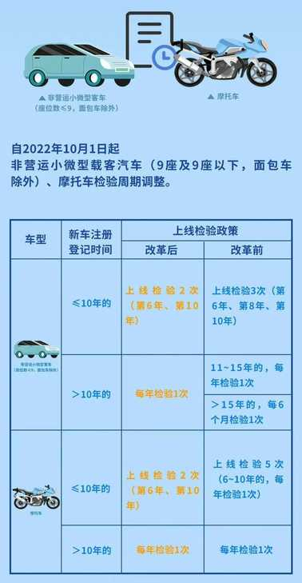
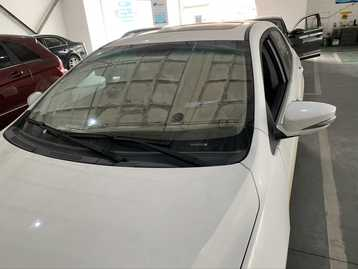
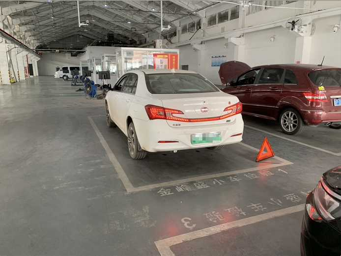
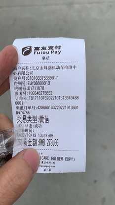

# 我的机动车年检

## 背景

2016底购买新能源纯电汽车，到2022年底已满6年，该去检测场现场进行年检（或叫年审）。

一方面由于车买的早，电池续航短，加装了一个柴暖驻车加热器，用于取暖，担心年检不过；另一方面毕竟是自己的第一辆车，第一次年检，对于流程不是特别熟悉。

将本次验车的过程记录下来，方便自己以后查阅，也方便给大家一个参考。

## 2022年检新规

> 针对于私家车来说，主要关注的就是：原来需要在第8年进行一次现场检测，新规去掉这一次现场检测。

## 我的检测流程

### 预约检测

按照规则是需要提前在 12123上 或 电话 预约检测，有网友反馈说大多数检测场是不需要预约的，有条件最好是预约一下吧。

我选择在 12123APP 上进行预约，约的是10月13号，北京金峰盛机动车检测场，约的是工作日，公司附近，下午13:00开始检测，不耽误上班，也不耽误周末时间。

### 准备材料

在 12123APP 预约的时候，会提示需要哪些注意事项，通常是需要注意如下点：

- 将车辆违章全部处理完。
- 车辆改装的需要再改回。如车灯、贴纸(可能没有关系)...
- 行驶证。
- 身份证（送检人、车主）。
- 完税证明。
- 有效期内保险单。

到我检测的时候，其实只要了：**行驶证、车主身份证**，我猜想其它的估计是可以直接联网查询吧。

### 当日检测

当日查看了下 12123APP 上的预约记录，发现消失了，以为没有预约上。其实是系统问题，是正常的。

我担心排队耽误事，大概在中午12:20左右就到达到检测场，到大门口的时候，门口保安问了干啥，有没有预约，我说预约了，但是记录没有了；保安说那是正常的。然后就扫了健康宝。

开车进去右拐到检测地点排队，前面有一个车在排队，然后就把车停到车位里，突然发现，后玻璃上有个贴纸"途虎养车"，担心有问题，赶紧给扣了下来。

时间还早，就在车里睡一会儿。

迷迷糊糊，感觉有动静，一看12:55了，起来一看，6个车位也都停满了，外面还有几辆车在排队。我看到别人都在摆东西，我也照着别人做：将三脚架打开转置于车辆右后方地上；将行驶证置于主架位置前操作台上。然后坐回驾驶室启动车辆等着。

准时13:00检测人员上班，围着车转了一圈，**说让把 前引擎盖支起来**，**前牌照少了两个螺丝**（之前出险，修理场少装了俩螺丝），之前给牌照时给的螺丝多，放在车里，我在那里找了螺丝刀，拧上了俩螺丝。重新坐回车里。

检测人员拿个单子，边看，边记录；最后站在后面，喊着让 打灯、雨刮器。按照他说的去做就是了。在这里要把车窗户摇下来，要不听不见他喊的声音。

然后下车，把车钥匙交给检测人员，进行后续检测。同时给了我一张单子，拿着单子去交费处交费。

新能源车交费比油车便宜一些，检测项目少的原因吧。交完费去大厅等待。我交完费去上了个厕所，还没有走到大厅，就看见我的车已经停到大厅前面的停车位了，看来排在前面是有优势，新能源车也检测的快，一起检测的油车还没有出来呢。

进大厅，在窗口有一堆我的单子，又要我车主身份证，就一个一个窗口自动走流程，具体在干啥，我也没有太注意，很快流程就走完了。

将行驶本、身份证、年检合格标给我，就可以走了。

## 注意项及问题

### 价格

新能源车比油车检测费用要便宜。不同的检测场价格不一样；根据群里车友提供的信息，我花费的检测费用是最高的 270元，而群里最便宜的是 200元。
