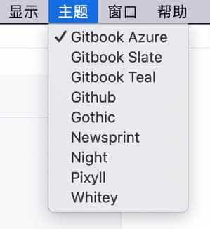
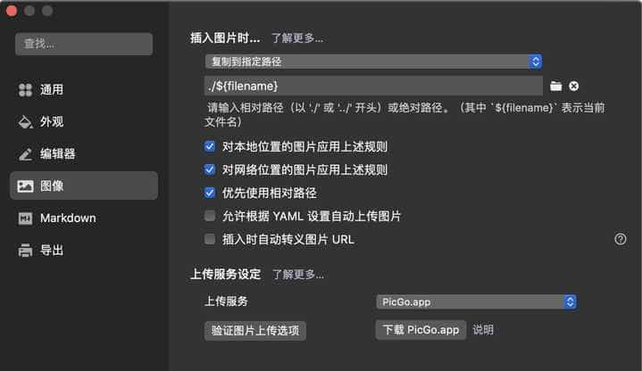

## 一些背景

- **电脑**：MacOS
- **职业**：程序员
- **Hexo版本** : hexo: 5.4.0；hexo-cli: 4.3.0

## 为何选择 Typora ？

大概从 2010 年开始，一直在使用微软的办公套件中的 OneNote 软件来记录日常的随笔、笔记。起初跟着别人用 OneNote，有微软的背书，当然不会差，最吸引我的好处就是：

- 漂亮大气。
- 基于 OneDrive 的云服务。
- 界面排版灵活。

对于我来说，OneNote 几个缺点是：

- 云服务不稳定。这个缺点，其实对我来说，并不是非常影响使用，只要最终能同步即可。
- **无法插入代码**。以前在 windows 下，还可以使用插件来实现（虽然很丑），MacOS 下没有插件支持。

市面上的笔记软件主要还有几个：有道云笔记、印象笔记、为知笔记。有道云笔记、印象笔记试用过，在国内，不存在 OneNote 的云服务不稳定的问题，没有选择这俩的原因就是感观上没有 OneNote 好看。为知笔记，是小厂出品，担心公司倒闭。

为什么选择了 Typora ？最主要的原因是 书写正式的技术博客文章时，有以下几个方面的原因：

- OneNote 无法很好地支持**代码高亮**。Typora 采用 markdown 格式，天然支持代码高亮。
- OneNote 在 MacOS 上字体排版比 windows 还是逊色不少。
- Typora 能很方便地将文章采用Hexo工具进行博客发布。而 OneNote 非常不方便。
- Typora 虽然采用 markdown 格式，但是有很好的图片插入规则，。

> 注：Typora 在 2021年11月份发布 1.0 正式版之后开始收费，历史版本：https://www.typora.io/dev_release.html。

## 为何选择 iCloud ?

Typora 本身不支持云服务，所以需要第三方云服务来同步、备份。可以用来做云服务的方法有很多，比如各厂商的云盘服务：百度网盘、坚果云等；当然也可以存储到一些免费的代码托管平台：Github、Gitee等。而我选择 iCloud，是因为我本身是 iCloud 的付费用户，在 MacOS 的 iCloud 云盘里面直接创建目录，就会自动同步，就可以在云端和本地都存储一份，iPhone 上也可以查看其内容。

## 为何选择 Hexo 来发布博客 ？

很长一段时间采用 Wordpress 来搭建个人博客，Wordpress 是一个博客管理平台，有后台，有前台，基于数据库管理，也是一个动态网站，功能强大，有一些插件来扩展功能，但比起 Hexo 这些静态博客生成工具来说，比较重。Hexo 简单易用，本地编辑 markdown，使用命令生成全站静态 HTML，再将文件进行托管即可。

## Typora 工具设置

Typora 有一些常用的配置需要设置，来适应自己的需求。

### 主题配置

- 实时修改主题

打开导航“主题”，直接选择相应的主题即可。



- 设置夜览模式主题

Typora 支持 MacOS 的夜览模式，打开导航（Typora -> 偏好设置 -> 外观 -> 主题）进行设置即可。

- 更多主题

如果想使用更多的主题，可以打开官方地址 [在线主题](https://theme.typora.io/)，下载相应的主题，拷贝至相应的目录（Typora -> 偏好设置 -> 外观 -> 主题 -> 打开主题文件夹），重启软件，即可在选项框中选择相应的主题。

### 图片编辑设置

- 图片插入设置

Hexo 编辑文章时，有一种方式是将图片等引用资源 放在 当前文件的同目录下 的 相同文件名的目录中（[参考 Hexo 文档说明](https://hexo.io/zh-cn/docs/asset-folders)），在 Typora 中，打开导航（Typora -> 偏好设置 -> 图像 -> 插入图片时），选择 复制到指定路径 ./${filename} 。



这样设置后，插入图片、截图复制粘帖进文章后，会自动将图片保存在 文件同名的目录 下。

> 采用这种方式的缺点就是，在有图片的文章同级目录下，会有一个同名的目录存在，目录树看起来有些不美观！可以将左侧导航栏切换为 文档 模式（MacOS快捷方式 control+command+2），仅显示文章，使其稍微美观一些！

> Typora 能很方便地支持网络图床的上传，为何不采用网络图床的方式来插入图片？
>
> - 在电脑离线情况下，无法查看图片。
> - 网络图床，大厂的一般都是收费的（不仅存储收费，请求数也收费，考虑到如果发布博客的话，请求数有可能不可控😓），免费的厂商担心不稳定，还是本地存储一份比较好。并且发布博客是在个人的云主机上，云主机本身也已经收费了，就没有必要花两份钱了。

- 调整图片尺寸、压缩

使用原始图片，会占用大量的存储空间，上传云服务后，也会占用云服务宝贵的空间。

如果仅仅是压缩图片，在 Mac 下可以采用 `ImageOptim` 工具，简单方便，但是此工具不能调整图片尺寸。

有些图片的尺寸很大，但内容很简单，在不影响显示的情况下，可以适当调小图片的尺寸，以缩小图片存储大小，图片的尺寸调整，可以采用工具`XnConvert`([下载地址](https://www.xnview.com/en/xnconvert/#downloads))来进行调整；它可以输入长宽、按比例进行调整，还可以修改文件的输出格式。

一般情况下，我会使用`XnConvert`来调整图片尺寸、格式，再用`ImageOptim`来再次压缩图片的存储大小。

> Typora 支持图片尺寸调整，为何不支持采用 Typora 支持的方式？
>
> - Typora 中，在图片上右键，有个缩放图片(调整图片的尺寸)，这种方式会采用 html 标签 `img` 的方式来实现，引用图片路径为相对路径，可能会在 Hexo 生成博客的存档页或主页显示不正确。
> - Typora 的缩放，并不会减少图片的存储大小。 

## 写文章

平时记录主要是两类，一类是快速记录，以便后续查看检索使得的笔记；一类是总结成文的完整文章，用于发布网络博客。笔记的话，就单独创建文件夹来记录

### 记笔记

对于码农来说，平常需要临时记录一些常用命令、代码段、应用安装步骤等，主要特点就是简单的说明、代码行、图片等。Typora 的 Markdown 对代码行的支持天然比较好，图片如果不进行压缩等处理的话，也比较方便。

1. 创建文件夹。

   相比于其它的笔记软件，一个笔记本就是一整个大文件，在大文件里面支持多级目录及页面；从文件系统的角度来看，就是一个大文件，格式为笔记软件所特有的，一般不可以被其它笔记软件解析。而 Typora 并没有这种特性，想分目录、分类记录笔记，直接创建文件夹、子文件夹即可，笔记直接是 md 的文本文件，比较原始，操控感强。

2. 创建 md 文件记录笔记 。

   在上一步规划的相应的文件夹层级下，创建 md 文件，进行笔记编写即可。
   
2. 备份。

   采用个人 iCloud 进行云备份/同步。

### 写博客

对于日常的总结心得，成体系的文章，会形成博客发布至网络。以下是采用 Hexo 工具来进行博客的管理，以下展示日常主要用到的一些命令及操作，详细的 Hexo 用法参考官方介绍。

1. 创建博客站。

   ``` bash
   hexo init [folder]
   ## 示例
   hexo init zenfery-blog-hexo
   cd zenfery-blog-hexo
   npm install # 项目为一个 node 项目，此步安装相应的依赖包。
   ```

   创建完成后，站点项目 目录 zenfery-blog-hexo 下的文件夹 source 就是存放我们文章的地方，一般日常写文章都是在 source/_post 目录中。

2. 创建文章。

   ```bash
   hexo new [layout] <title>  # layout 默认为 post
   ## 示例
   hexo new "post title with whitespace"
   ```

   上面的命令创建的文件，会置于 _post 目录下，文件的名称由配置项 `new_post_name`来指定，如 `new_post_name: :year:month:day-:title.md`。

   若想在 _post 目录下，按照分类来创建**多级目录**也是可以的，命令如下：

   ```bash
   hexo new <layout> --path about/me <title>
   ## 示例
   hexo new post --path 软件工具/笔记博客/20211127-采用typora+icloud+hexo记录笔记及发布博客 "采用 Typora iCloud Hexo 记录笔记及发布博客"
   ```

3. 主要配置项。

   ```yaml
   ## 文章发布后的永久链接，会对标题进行 hash ，生成 hash 串，以防中文导致url很长及转码
   permalink: articles/:hash.html
   
   ## 分类及标签，生成连接时转义词对应关系
   category_map:
     随笔: essay
     Spring: spring
     Annotation: annotation
     前端: fe
   tag_map:
     多线程: multi-thread
     并发: concurrent
     技术感想: it-think
     
   ## 文章的更新时间，指定为文件的更新时间
   updated_option: 'mtime'
   
   ## 主题选择
   theme: fluid
   ```

   

4. 发布文章至网络博客。

   生成博客网站 html 页面。

   ```bash
   hexo g -f
   ```

   因博客网站是搭建在自己购买的云主机上，所以采用 sftp 方式进行网站发布。安装 `hexo-deployer-sftp`。

   ```bash
   npm install hexo-deployer-sftp --save
   ```

   因为发布信息涉及主机、用户名、密码等敏感信息，而我将博客站代码托管在 Github 上的公开代码库，所以将 sftp 的配置信息放置在单独的配置文件`_config.deploy.yml`中，忽略代码托管。

   ```yaml
   deploy:
     type: sftp
     host: 182.10.24.54
     user: test
     pass: 4cfa8e123fdr45gfd5394953e77891e
     remotePath: /home/admin/apps/docs/zenfery-blog-hexo/hexo/
     port: 22
   ```

   ```bash
   ## 发布命令，单独指定部署的配置文件
   hexo d --config _config.deploy.yml
   ```

## 检索内容

笔记文章写完后，时间长了，想回顾或使用以前的笔记，有哪些方法呢？

- 树形目录索引。

  先前按照统一的思路创建的目录索引，可以帮助我们找到想要查看的文章。

- 搜索功能。

  Typora 本身提供了搜索功能，可以按文件名、文件内容进行搜索。默认在界面左侧搜索框中进行搜索。

## 常见问题

### 图片路径问题

通过常规的 markdown 语法和相对路径来引用图片和其它资源可能会导致它们在存档页或者主页上显示不正确。在 Hexo 3 中可以采用以下的插件来引用图片：

```html

<!-- 示例 -->

```

但是这种方式，在本地电脑的 Typora 编辑器中便不能很好地显示图片，所以在开启`_config.yml`的配置 `post_asset_folder: true`下，可以安装 npm 包 [hexo-image-link](https://github.com/cocowool/hexo-image-link)来解决。这样还可以使用 markdown 的语法，也能够在发布时，保证图片路径的正确引用。

当然在 Hexo 3.1.0 版本后，提供了新的配置也可以实现：

```jaml
post_asset_folder: true
marked:
  prependRoot: true
  postAsset: true
```

### 配置不生效

如果更换了 Hexo 主题，或者修改了某些配置怎么都不生效；那么可能是缓存的问题。我在使用的过程中，发现图片的路径怎么都不对。只需要在生成发布文件之前，执行清理命令即可：

```bash
hexo clean
```

